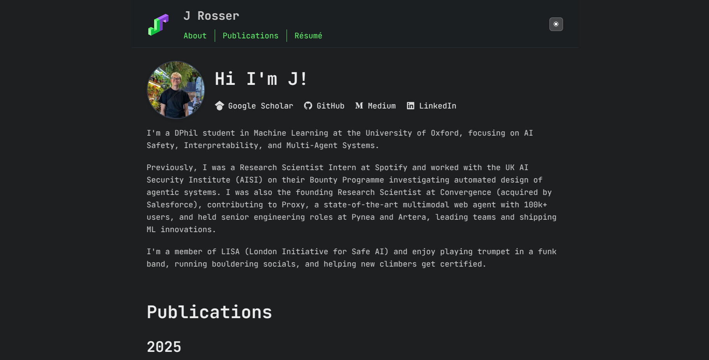

<<<<<<< HEAD
=======
Personal portfolio website for Alireza Javanmardi, featuring research, publications, and selected projects in visual computing, generative modeling, and diffusion models.

**Live site:** [ajavanmardii.github.io](https://ajavanmardii.github.io)

## Preview




## Tech Stack

- Vanilla HTML, CSS, JavaScript
- Markdown content
- GitHub Pages hosting

## Development

```bash
# Serve locally
python -m http.server 8000 -d docs/
```

## Structure

- `docs/index.html` - Main page
- `docs/*.md` - Content (about, publications, projects, resume)
- `docs/styles.css` - Styling
- `docs/script.js` - Functionality

Inspired by [astro-theme-cactus](https://astro-cactus.chriswilliams.dev/) :)
>>>>>>> 4e9db8f (adding info)
