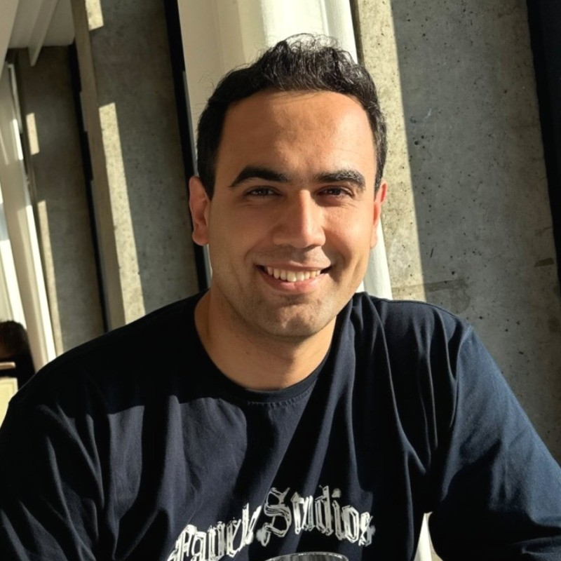

  
  

    <h1 class="title">Hi, I'm Alireza!</h1>
    

      <a href="https://av.dfki.de/members/javanmardi" target="_blank" rel="noopener" style="display:inline-flex;align-items:center;gap:0.5rem;text-decoration:none;color:var(--color-accent-2);">
        <svg xmlns="http://www.w3.org/2000/svg" viewBox="0 0 24 24" fill="currentColor" style="width:20px;height:20px;opacity:0.9;">
          <path d="M12 2 3 6.5v5c0 5.2 3.6 10 9 11.5 5.4-1.5 9-6.3 9-11.5v-5L12 2Zm0 2.2 7 3.5v3.8c0 4.2-2.8 8-7 9.4-4.2-1.4-7-5.2-7-9.4V7.7l7-3.5Z"/>
        </svg>
        DFKI Profile
      </a>
      <a href="https://scholar.google.com/citations?user=SR_4n3kAAAAJ&hl=en" target="_blank" rel="noopener" style="display:inline-flex;align-items:center;gap:0.5rem;text-decoration:none;color:var(--color-accent-2);">
        <svg viewBox="0 0 24 24" role="img" aria-hidden="true" style="width:20px;height:20px;opacity:0.9;" xmlns="http://www.w3.org/2000/svg" fill="currentColor">
          <path d="M12 24a7 7 0 1 1 0-14 7 7 0 0 1 0 14Zm0-24L0 9.5l4.838 3.94A8 8 0 0 1 12 9a8 8 0 0 1 7.162 4.44L24 9.5 12 0Z"/>
        </svg>
        Google Scholar
      </a>
      <a href="https://www.linkedin.com/in/alireza-javanmardi-06889a123/" target="_blank" rel="noopener" style="display:inline-flex;align-items:center;gap:0.5rem;text-decoration:none;color:var(--color-accent-2);">
        <svg stroke="currentColor" fill="currentColor" stroke-width="0" viewBox="0 0 24 24" aria-hidden="true" style="width:20px;height:20px;opacity:0.9;" xmlns="http://www.w3.org/2000/svg">
          <path d="M20 3H4a1 1 0 0 0-1 1v16a1 1 0 0 0 1 1h16a1 1 0 0 0 1-1V4a1 1 0 0 0-1-1ZM8.339 18.337H5.667v-8.59h2.672v8.59ZM7.003 8.574a1.548 1.548 0 1 1 0-3.096 1.548 1.548 0 0 1 0 3.096Zm11.335 9.763h-2.669V14.16c0-.996-.018-2.277-1.388-2.277-1.39 0-1.601 1.086-1.601 2.207v4.248h-2.667v-8.59h2.56v1.174h.037c.355-.675 1.227-1.387 2.524-1.387 2.704 0 3.203 1.778 3.203 4.092v4.71Z"/>
        </svg>
        LinkedIn
      </a>
      <a href="mailto:alireza.javanmardi@dfki.de" style="display:inline-flex;align-items:center;gap:0.5rem;text-decoration:none;color:var(--color-accent-2);">
        <svg xmlns="http://www.w3.org/2000/svg" viewBox="0 0 16 16" fill="currentColor" style="width:20px;height:20px;opacity:0.9;">
          <path d="M0 4a2 2 0 0 1 2-2h12a2 2 0 0 1 2 2v8a2 2 0 0 1-2 2H2a2 2 0 0 1-2-2V4Zm2-1a1 1 0 0 0-1 1v.217l7 4.2 7-4.2V4a1 1 0 0 0-1-1H2Zm13 2.383-4.708 2.825L15 11.105V5.383Zm-.034 6.876-5.64-3.471L8 9.583l-1.326-.795-5.64 3.47A1 1 0 0 0 2 13h12a1 1 0 0 0 .966-.741ZM1 11.105l4.708-2.897L1 5.383v5.722Z"/>
        </svg>
        Email
      </a>
    

  

I am a researcher at DFKI’s Augmented Vision Department, where I contributed to the EU CORTEX2 project. My work lies at the intersection of visual computing and generative AI, with a focus on diffusion models, neural rendering, and face animation.

 Previously, I was a research intern at the Max Planck Institute for Informatics in the Image Synthesis and Machine Learning Group. I received my bachelor and master in Electrical Engineering.

<!-- 
His recent work appears at CVPR 2026, WACV 2026, SIGGRAPH 2024, BMVC 2024, and AIxVR 2023. He also received the Best Paper Award at RSCy 2025 for work on spatiotemporal diffusion models for satellite imagery.
 -->
