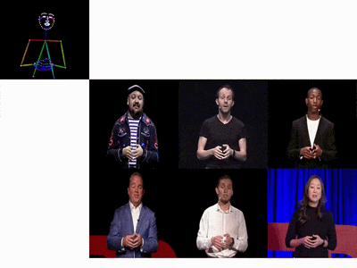
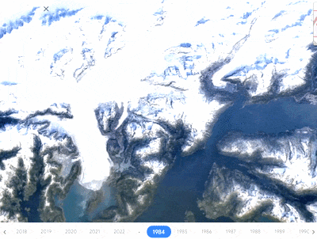
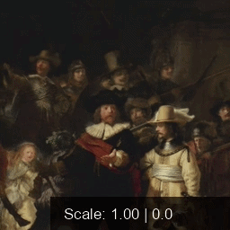

# Publications

## 2026

  

    <h3 class="publication-title">ReLaGS: Relational Language Gaussian Splatting</h3>
    
CVPR 2026

    
Y. Xie, A. Arafa, <strong>A. Javanmardi</strong>, C. Millerdurai, J. Hu, S. Wang, A. Pagani, D. Stricker

    <!-- 
2026
 -->
    

      <a class="publication-action" href="https://dfki-av.github.io/ReLaGS/" target="_blank" rel="noopener noreferrer">Project Page</a>
      <a class="publication-action" href="https://arxiv.org/pdf/2603.17605" target="_blank" rel="noopener noreferrer">Paper</a>
      <a class="publication-action" href="https://github.com/dfki-av/ReLaGS" target="_blank" rel="noopener noreferrer">Code</a>
    

  

  

    
  

  

    <h3 class="publication-title">TalkingPose: Efficient Face and Gesture Animation with Feedback-guided Diffusion Model</h3>
    
WACV 2026

    
<strong>A. Javanmardi</strong>, P. Jaiswal, T. A. Habtegebrial, C. Millerdurai, S. Wang, A. Pagani, D. Stricker

    <!-- 
2026
 -->
    

      <a class="publication-action" href="https://dfki-av.github.io/TalkingPose/" target="_blank" rel="noopener noreferrer">Project Page</a>
      <a class="publication-action" href="https://arxiv.org/pdf/2512.00909" target="_blank" rel="noopener noreferrer">Paper</a>
      <a class="publication-action" href="https://github.com/dfki-av/TalkingPose/tree/main" target="_blank" rel="noopener noreferrer">Code</a>
    

  

  

    
  

## 2025

  

    <h3 class="publication-title">Spatiotemporal Diffusion Model for Satellite Imagery</h3>
    
RSCy 2025 (Best Paper Award)

    
P. N. Kashyap, <strong>A. Javanmardi</strong>, P. Jaiswal, G. Reis, A. Pagani, D. Stricker

    <!-- 
2025
 -->
    

      <!-- <a class="publication-action" href="#" target="_blank" rel="noopener noreferrer">Project Page</a> -->
      <a class="publication-action" href="https://www.dfki.uni-kl.de/~pagani/papers/Kashyap2025_RSCy.pdf" target="_blank" rel="noopener noreferrer">Paper</a>
      <a class="publication-action" href="https://github.com/dfki-av/STDS" target="_blank" rel="noopener noreferrer">Code</a>
    

  

  

    
  

## 2024

  

    <h3 class="publication-title">Learning Images Across Scales Using Adversarial Training</h3>
    
ACM Transactions on Graphics (SIGGRAPH) 2024

    
K. Wolski, A. Djeacoumar, <strong>A. Javanmardi</strong>, H.-P. Seidel, C. Theobalt, G. Cordonnier, K. Myszkowski, G. Drettakis, X. Pan, T. Leimkuhler

    <!-- 
2024
 -->
    

      <a class="publication-action" href="https://scalespacegan.mpi-inf.mpg.de/" target="_blank" rel="noopener noreferrer">Project Page</a>
      <a class="publication-action" href="https://scalespacegan.mpi-inf.mpg.de/files/scalespacegan_paper.pdf" target="_blank" rel="noopener noreferrer">Paper</a>
      <a class="publication-action" href="https://github.com/Chuudy/scalespacegan" target="_blank" rel="noopener noreferrer">Code</a>
    

  

  

    
  

  

    <h3 class="publication-title">G3FA: Geometry-guided GAN for Face Animation</h3>
    
BMVC 2024

    
<strong>A. Javanmardi</strong>, A. Pagani, D. Stricker

    <!-- 
2024
 -->
    

      <!-- <a class="publication-action" href="#" target="_blank" rel="noopener noreferrer">Project Page</a> -->
      <a class="publication-action" href="https://arxiv.org/pdf/2408.13049" target="_blank" rel="noopener noreferrer">Paper</a>
      <a class="publication-action" href="https://github.com/dfki-av/G3FA" target="_blank" rel="noopener noreferrer">Code</a>
    

  

  

    
  

